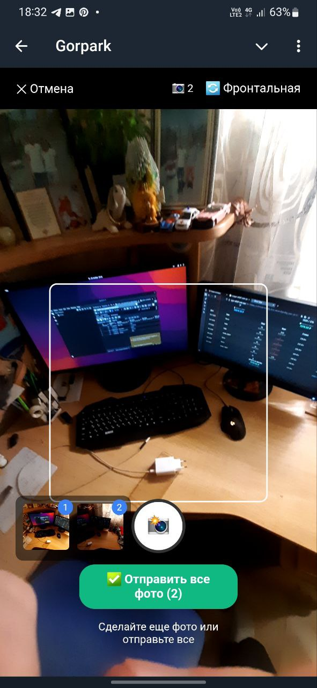
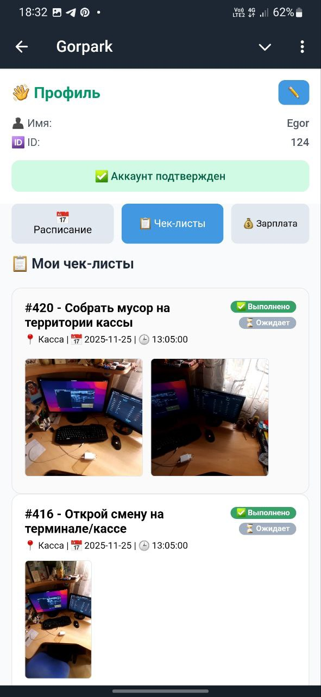

# 📝 CRM Fly Park: Система управления персоналом и контроля качества

Комплексное решение для автоматизации работы развлекательных центров, реализованное в формате **Telegram Web App**. Система объединяет в себе учет рабочего времени, контроль задач через фотоотчеты и автоматизированный расчет заработной платы.

---

## 🚀 Основные возможности

### 👨‍💼 Для Администратора
* **Управление кадрами:** Верификация новых сотрудников и гибкое управление ролями.
* **Контроль смен:** Визуальный календарь расписания с привязкой к игровым зонам.
* **Инспекция качества:** Проверка выполнения чек-листов с просмотром фотофиксации в реальном времени.
* **Автоматизация выплат:** Расчет ЗП на основе фактического времени работы, системы штрафов и премий.


> *Демонстрация работы вкладок администратора*

---

### 👷 Для Сотрудника
* **Check-in/Check-out:** Фиксация начала и конца смены с обязательным селфи-подтверждением.
* **Интерактивные чек-листы:** Получение задач по зоне и быстрая загрузка фотоотчетов.
* **Прозрачный баланс:** Просмотр начислений, детализация штрафов и бонусов в личном кабинете.

<p align="center">
  
  
</p>
> *Процесс работы сотрудника через Telegram: фото фиксация и список задач*

---

## 🛠 Технологический стек

### Backend (Golang)
* **Core:** `net/http` для API, `telebot.v4` для взаимодействия с Telegram.
* **Database:** `PostgreSQL 17` + `pg_cron` (автоматизация задач на уровне БД).
* **Real-time:** `MQTT` (mosquitto) для мгновенной доставки уведомлений.
* **Scheduler:** Внутренний планировщик для рассылки утренних напоминаний и очистки старых данных.

### Frontend (React)
* **UI:** `React.js` + интеграция через `Telegram Web App SDK`.
* **Media:** `react-webcam` для работы с камерой внутри мессенджера.
* **Communication:** `MQTT.js` через WebSockets.

---

## 🏗 Как запустить

1. Создайте `.env` файл в папке [tg-web-app-bot](./tg-web-app-bot/):
2. Импортируйте структуру БД из `backup4.sql`.
3. Запустите mqtt брокер (mosquitto).
4. Запустите сервер: `go run main.go`.
5. Запустите сайт: `npm start`.

``` Пример .env
    TELEGRAM_BOT_TOKEN=your_bot_token_here
    WEB_APP_URL=https://your-domain.ru:3000
    MQTT_SERVER=mqtt://localhost:1883

    DB_HOST=127.0.0.1
    DB_PORT=5432
    DB_USER=postgres
    DB_PASSWORD=your_password
    DB_NAME=gorpark
    ```
